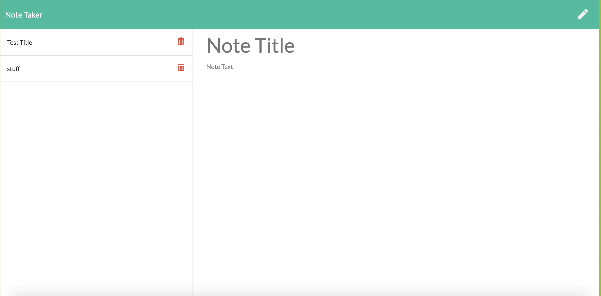

# Note-Taker

## Description

This application can be used to write, save, and delete your notes. The application uses express on the backend and saves and retrieves note data from a JSON file.

**## Table of Contents**

1. [Installation Instructions](#installation-instructions)
2. [Usage Information](#usage-information)
3. [Test Instructions](#test-instructions)
4. [Questions](#questions)

## Installation Instructions

To install the application, run 'npm i' in your terminal to ensure that all dependencies are downloaded locally.

## Usage Information

View the application: <a href="https://secure-everglades-66379.herokuapp.com/">Deployed Link</a>

## Test Instructions

This application does not currently have any testing suites.

# Questions

For any questions about this assignment, feel free to reach out to me on github or my email. Thank you for viewing this application.

https://github.com/Jacob1205/Note-Taker
simplyjacob00@gmail.com
